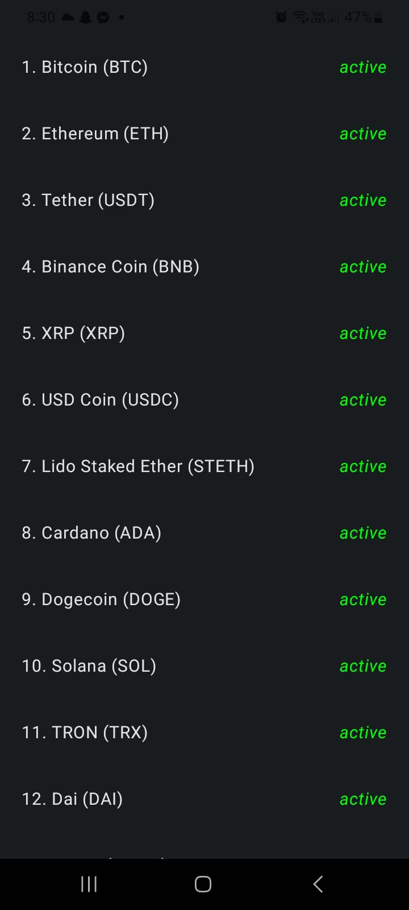
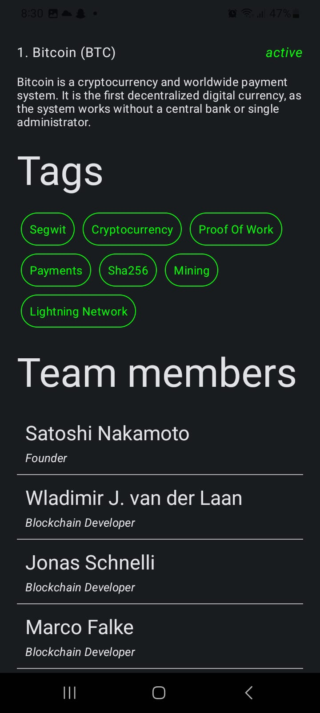

# Compose-Cryptocurrency-App
 
 

# Description
Simple Cryptocurrency App that allows user to list all digital currency and know all details related to it 
# Features:
1- Show all currencies. 
2- Show details of currency. 

# Built with:
• Kotlin 
• Jetpack Compose 
• MVVM Clean Architecture 
• Retrofit 
• Hilt 
• Coroutines 
• Compose Navigation 

# Screen Shots

